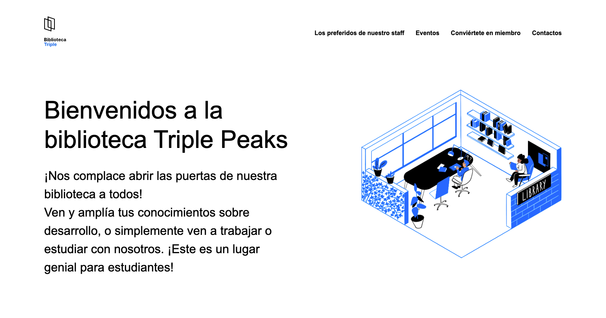

# Biblioteca Triple Peaks

¡Bienvenido a la Biblioteca Triple Peaks! Este es un proyecto de sitio web para la biblioteca local que proporciona información sobre los servicios y eventos que ofrecemos, así como los libros favoritos de nuestros lectores.

## Descripción

La Biblioteca Triple Peaks es un lugar acogedor para estudiar, trabajar y ampliar conocimientos. Este sitio web está diseñado para facilitar la navegación y proporcionar toda la información relevante sobre la biblioteca, incluyendo:

- Información sobre la biblioteca y su ubicación.
- Los libros favoritos de nuestros lectores.
- Eventos y actividades programadas.
- Cómo convertirse en miembro de la biblioteca.
- Información de contacto.

## Estructura del Proyecto

El proyecto está organizado de la siguiente manera:

│
├── index.html           # Página principal de la biblioteca
├── styles/
│   ├── normalize.css    # CSS para normalizar estilos
│   └── style.css        # Estilos personalizados para la página
├── images/
│   ├── logo.svg         # Logotipo de la biblioteca
│   └── inside_the_library.png  # Imagen de la biblioteca
├── vendor/
│   └── normalize.css    # Archivo de normalización de CSS
└── README.md            # Archivo README con información del proyecto

## Tecnologías Utilizadas

- **HTML**: Para estructurar el contenido de la página.
- **CSS**: Para dar estilo y diseño a la página.
- **Normalize.css**: Para normalizar los estilos predeterminados del navegador y asegurar consistencia.

## Cómo Ver el Proyecto

Para ver el proyecto en tu navegador local:

1. Clona el repositorio:
    ```bash
    git clone https://github.com/luuzuriaga/sprint2GH
    ```
2. Navega al directorio del proyecto:
    ```bash
    cd biblioteca-triple-peaks
    ```
3. Abre el archivo `index.html` en tu navegador preferido.

## Capturas de Pantalla

### Página Principal


## Licencia

Este proyecto está bajo la Licencia MIT. 

## Contacto

Si tienes alguna pregunta o sugerencia, no dudes en ponerte en contacto con nosotros:

¡Gracias por visitar la Biblioteca Triple Peaks!
